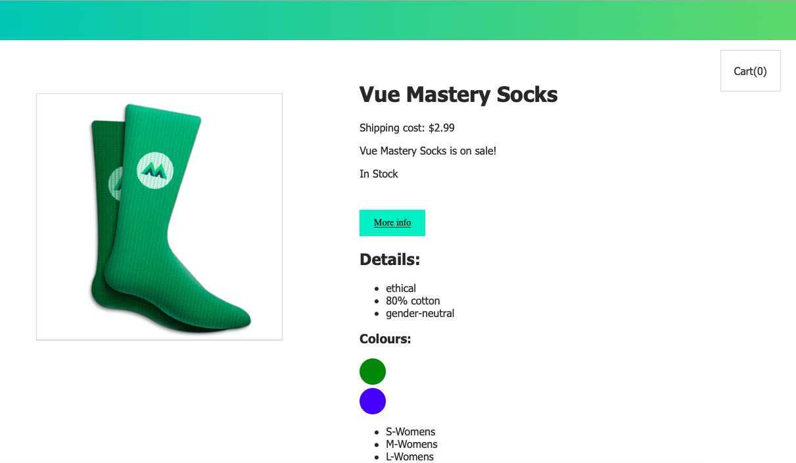

# Vue Socks project
Vue Mastery's Introduction to Vue Course

This is a tutorial project from Vue Mastery. It goes over the basics of creating your first Vue.js application, covering topics such as the Vue Instance, Vue syntax, data binding, templating, methods vs. computed properties, directives, EventBus, and so on. You check out the lesson [here] (https://www.vuemastery.com/courses/intro-to-vue-js/tabs).

- <strong>NOTE:</strong> This project was built using Vue.js 2! See the [vuejs/vue-next](https://github.com/vuejs/vue-next) for (beta) documentation into Vue 3 changes!

### Built with:
- Vue.js of course 😉
- Vue CDN from [unpkg](https://unpkg.com/vue)

For more info and documentation, visit https://vuejs.org

## Getting Started

I've used a Vue CDN from [unpkg] (https://unpkg.com/vue) in this project. In your own projects, you may choose to use [cdnjs] (https://cdnjs.cloudflare.com/ajax/libs/vue/2.6.11/vue.js), but it may take time to sync and load. For your own learning and/or development purposes you may use either CDN.

For learning/development:
- `` with cdnjs
- `` with unpkg

For production purposes, it is recommended by Vue.js to specify a version number to prevent breakages:
- ``

For more detailed info on installation, see Vue.js [installation docs] (https://vuejs.org/v2/guide/installation.html)

## In general, if you're using Vue CLI (you should have npm installaed):

### 1. Install dependencies
`$ npm init` to install the necessary npm modules

### 2. Start up a local development server
`$ npm run serve`

### 3. Congrats! Your local development server will be running at http://localhost:8080/

